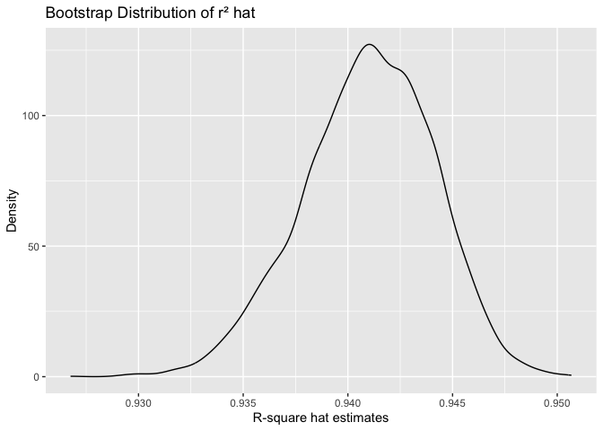
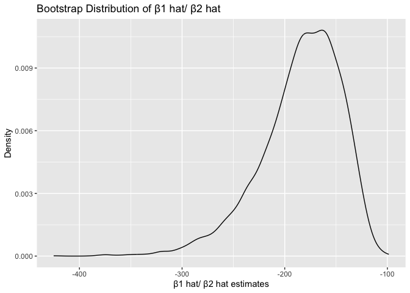
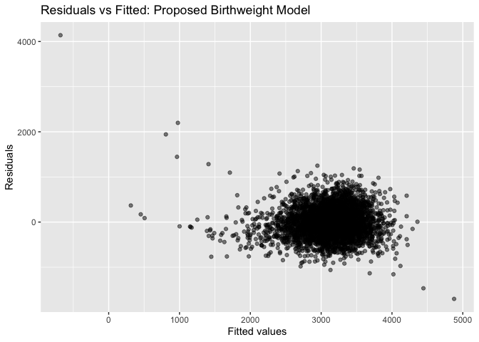

p8105_hw6_mk4996
================
Miho Kawanami
2025-12-01

``` r
library(tidyverse)
```

    ## ── Attaching core tidyverse packages ──────────────────────── tidyverse 2.0.0 ──
    ## ✔ dplyr     1.1.4     ✔ readr     2.1.5
    ## ✔ forcats   1.0.0     ✔ stringr   1.5.1
    ## ✔ ggplot2   3.5.2     ✔ tibble    3.3.0
    ## ✔ lubridate 1.9.4     ✔ tidyr     1.3.1
    ## ✔ purrr     1.1.0     
    ## ── Conflicts ────────────────────────────────────────── tidyverse_conflicts() ──
    ## ✖ dplyr::filter() masks stats::filter()
    ## ✖ dplyr::lag()    masks stats::lag()
    ## ℹ Use the conflicted package (<http://conflicted.r-lib.org/>) to force all conflicts to become errors

``` r
library(p8105.datasets)
library(modelr)
library(broom)
```

    ## 
    ## Attaching package: 'broom'
    ## 
    ## The following object is masked from 'package:modelr':
    ## 
    ##     bootstrap

``` r
set.seed(1)
```

# Problem 1

## Filtering the data

``` r
homicide_raw = 
  read_csv("./homicide-data.csv")
```

    ## Rows: 52179 Columns: 12
    ## ── Column specification ────────────────────────────────────────────────────────
    ## Delimiter: ","
    ## chr (9): uid, victim_last, victim_first, victim_race, victim_age, victim_sex...
    ## dbl (3): reported_date, lat, lon
    ## 
    ## ℹ Use `spec()` to retrieve the full column specification for this data.
    ## ℹ Specify the column types or set `show_col_types = FALSE` to quiet this message.

``` r
homicide_df = 
  homicide_raw |> 
  mutate(
    city_state = str_c(city, ", ", state),
    resolved  = as.numeric(disposition == "Closed by arrest")
  ) |> 

  filter(
    !(city_state %in% c(
      "Dallas, TX", "Phoenix, AZ", "Kansas City, MO", "Tulsa, AL"
    ))
  ) |>

  filter(victim_race %in% c("White", "Black")) |>

  mutate(victim_age = as.numeric(victim_age)) |>

  select(city_state, resolved, victim_age, victim_sex, victim_race)
```

    ## Warning: There was 1 warning in `mutate()`.
    ## ℹ In argument: `victim_age = as.numeric(victim_age)`.
    ## Caused by warning:
    ## ! NAs introduced by coercion

## Baltimore, MD

``` r
baltimore_df = 
  homicide_df |> 
  filter(city_state == "Baltimore, MD")

fit_baltimore = 
  baltimore_df |> 
  glm(
    resolved ~ victim_age + victim_race + victim_sex,
    data   = _,
    family = binomial()
  )

or_ci_baltimore = 
  fit_baltimore |> 
  broom::tidy(conf.int = TRUE) |> 
  mutate(
    OR       = exp(estimate),
    conf.low = exp(conf.low),
    conf.high = exp(conf.high)
  ) |>
  filter(term == "victim_sexMale") |>
  select(term, OR, conf.low, conf.high)

or_ci_baltimore
```

    ## # A tibble: 1 × 4
    ##   term              OR conf.low conf.high
    ##   <chr>          <dbl>    <dbl>     <dbl>
    ## 1 victim_sexMale 0.426    0.324     0.558

## Each city

``` r
city_or_results = 
  homicide_df |> 
  nest(data = -city_state) |> 
  mutate(
    models = map(
      data,
      \(df) glm(
        resolved ~ victim_age + victim_race + victim_sex,
        data   = df,
        family = binomial()
      )
    ),
    results = map(
      models,
      \(mod) broom::tidy(mod, conf.int = TRUE)
    )
  ) |>
  select(-data, -models) |>
  unnest(results) |>
  mutate(
    OR       = exp(estimate),
    conf.low = exp(conf.low),
    conf.high = exp(conf.high)
  ) |>
  filter(term == "victim_sexMale") |>
  select(city_state, OR, conf.low, conf.high)
```

    ## Warning: There were 43 warnings in `mutate()`.
    ## The first warning was:
    ## ℹ In argument: `results = map(models, function(mod) broom::tidy(mod, conf.int =
    ##   TRUE))`.
    ## Caused by warning:
    ## ! glm.fit: fitted probabilities numerically 0 or 1 occurred
    ## ℹ Run `dplyr::last_dplyr_warnings()` to see the 42 remaining warnings.

``` r
city_or_results
```

    ## # A tibble: 47 × 4
    ##    city_state         OR conf.low conf.high
    ##    <chr>           <dbl>    <dbl>     <dbl>
    ##  1 Albuquerque, NM 1.77     0.825     3.76 
    ##  2 Atlanta, GA     1.00     0.680     1.46 
    ##  3 Baltimore, MD   0.426    0.324     0.558
    ##  4 Baton Rouge, LA 0.381    0.204     0.684
    ##  5 Birmingham, AL  0.870    0.571     1.31 
    ##  6 Boston, MA      0.674    0.353     1.28 
    ##  7 Buffalo, NY     0.521    0.288     0.936
    ##  8 Charlotte, NC   0.884    0.551     1.39 
    ##  9 Chicago, IL     0.410    0.336     0.501
    ## 10 Cincinnati, OH  0.400    0.231     0.667
    ## # ℹ 37 more rows

``` r
city_or_results |> 
  mutate(city_state = fct_reorder(city_state, OR)) |>
  ggplot(aes(x = city_state, y = OR)) +
  geom_point() +
  geom_errorbar(aes(ymin = conf.low, ymax = conf.high), width = 0) +
  geom_hline(yintercept = 1, linetype = "dashed") +
  coord_flip() +
  labs(
    x = "City",
    y = "Adjusted OR (Male vs Female)",
    title = "Adjusted OR of case resolution, Male vs Female victims"
  )
```

<!-- -->

# Problem 2

## Bootstrap: weather data

``` r
data("weather_df")

weather_fit = 
  weather_df |>
  lm(tmax ~ tmin + prcp, data = _)

set.seed(1)

boot_results = 
  weather_df |> 
  modelr::bootstrap(n = 5000) |> 
  mutate(
    models = map(
      strap,
      \(df) lm(tmax ~ tmin + prcp, data = df)
    ),
    glance_res = map(models, broom::glance),
    tidy_res   = map(models, broom::tidy)
  ) |>
  select(-strap, -models) |>
  mutate(
    glance_res = map(glance_res, as_tibble),
    tidy_res   = map(tidy_res,   as_tibble)
  ) |>
  unnest(glance_res) |>

  select(.id, r.squared, tidy_res) |>
  unnest(tidy_res) |>
  select(.id, r.squared, term, estimate) |>

  pivot_wider(
    names_from  = term,
    values_from = estimate
  ) |>
  mutate(
    r_sq         = r.squared,
    beta1_over_2 = tmin / prcp
  ) |>
  select(.id, r_sq, beta1_over_2)

boot_results
```

    ## # A tibble: 5,000 × 3
    ##    .id    r_sq beta1_over_2
    ##    <chr> <dbl>        <dbl>
    ##  1 0001  0.941        -202.
    ##  2 0002  0.940        -222.
    ##  3 0003  0.944        -166.
    ##  4 0004  0.941        -228.
    ##  5 0005  0.944        -149.
    ##  6 0006  0.938        -172.
    ##  7 0007  0.943        -181.
    ##  8 0008  0.942        -229.
    ##  9 0009  0.938        -152.
    ## 10 0010  0.940        -205.
    ## # ℹ 4,990 more rows

## Density Plot

``` r
rsquare_plot = boot_results |> 
  ggplot(aes(x = r_sq)) +
  geom_density() +
  labs(
    x = "R-square hat estimates",
    y = "Density",
    title = "Bootstrap Distribution of r² hat")

rsquare_plot
```

<!-- -->

``` r
# β¹ ÷ β² distribution
slope_plot = boot_results |> 
  ggplot(aes(x = beta1_over_2)) +
  geom_density() +
  labs(
    x = "β1 hat/ β2 hat estimates",
    y = "Density",
    title = "Bootstrap Distribution of β1 hat/ β2 hat")

slope_plot
```

<!-- -->

## 95%CI

``` r
boot_summary =
  boot_results |>
  summarize(
    r_sq_low  = quantile(r_sq,         0.025),
    r_sq_high = quantile(r_sq,         0.975),
    ratio_low = quantile(beta1_over_2, 0.025),
    ratio_high = quantile(beta1_over_2, 0.975)
  )

boot_summary
```

    ## # A tibble: 1 × 4
    ##   r_sq_low r_sq_high ratio_low ratio_high
    ##      <dbl>     <dbl>     <dbl>      <dbl>
    ## 1    0.934     0.947     -280.      -126.

- **Comments**

The bootstrap distribution of $\hat{R}^2$ is narrow and centered around
0.94, indicating that the model’s explanatory power is stable across
samples. The 95% confidence interval for $R^2$ is \[0.934, 0.947\].

In contrast, the distribution of $\hat{\beta}_1 / \hat{\beta}_2$ is much
wider, showing substantial uncertainty in this ratio. Its 95% confidence
interval is \[–280, –126\].

# Problem 3

## 1. Load and Prepare Birthweight Data

``` r
birthweight_df = 
  read_csv("./birthweight.csv") 
```

    ## Rows: 4342 Columns: 20
    ## ── Column specification ────────────────────────────────────────────────────────
    ## Delimiter: ","
    ## dbl (20): babysex, bhead, blength, bwt, delwt, fincome, frace, gaweeks, malf...
    ## 
    ## ℹ Use `spec()` to retrieve the full column specification for this data.
    ## ℹ Specify the column types or set `show_col_types = FALSE` to quiet this message.

``` r
  # Check missing values
colSums(is.na(birthweight_df))　
```

    ##  babysex    bhead  blength      bwt    delwt  fincome    frace  gaweeks 
    ##        0        0        0        0        0        0        0        0 
    ##  malform menarche  mheight   momage    mrace   parity  pnumlbw  pnumsga 
    ##        0        0        0        0        0        0        0        0 
    ##    ppbmi     ppwt   smoken   wtgain 
    ##        0        0        0        0

``` r
  skimr::skim(birthweight_df)
```

|                                                  |                |
|:-------------------------------------------------|:---------------|
| Name                                             | birthweight_df |
| Number of rows                                   | 4342           |
| Number of columns                                | 20             |
| \_\_\_\_\_\_\_\_\_\_\_\_\_\_\_\_\_\_\_\_\_\_\_   |                |
| Column type frequency:                           |                |
| numeric                                          | 20             |
| \_\_\_\_\_\_\_\_\_\_\_\_\_\_\_\_\_\_\_\_\_\_\_\_ |                |
| Group variables                                  | None           |

Data summary

**Variable type: numeric**

| skim_variable | n_missing | complete_rate | mean | sd | p0 | p25 | p50 | p75 | p100 | hist |
|:---|---:|---:|---:|---:|---:|---:|---:|---:|---:|:---|
| babysex | 0 | 1 | 1.49 | 0.50 | 1.00 | 1.00 | 1.00 | 2.00 | 2.0 | ▇▁▁▁▇ |
| bhead | 0 | 1 | 33.65 | 1.62 | 21.00 | 33.00 | 34.00 | 35.00 | 41.0 | ▁▁▆▇▁ |
| blength | 0 | 1 | 49.75 | 2.72 | 20.00 | 48.00 | 50.00 | 51.00 | 63.0 | ▁▁▁▇▁ |
| bwt | 0 | 1 | 3114.40 | 512.15 | 595.00 | 2807.00 | 3132.50 | 3459.00 | 4791.0 | ▁▁▇▇▁ |
| delwt | 0 | 1 | 145.57 | 22.21 | 86.00 | 131.00 | 143.00 | 157.00 | 334.0 | ▅▇▁▁▁ |
| fincome | 0 | 1 | 44.11 | 25.98 | 0.00 | 25.00 | 35.00 | 65.00 | 96.0 | ▃▇▅▂▃ |
| frace | 0 | 1 | 1.66 | 0.85 | 1.00 | 1.00 | 2.00 | 2.00 | 8.0 | ▇▁▁▁▁ |
| gaweeks | 0 | 1 | 39.43 | 3.15 | 17.70 | 38.30 | 39.90 | 41.10 | 51.3 | ▁▁▂▇▁ |
| malform | 0 | 1 | 0.00 | 0.06 | 0.00 | 0.00 | 0.00 | 0.00 | 1.0 | ▇▁▁▁▁ |
| menarche | 0 | 1 | 12.51 | 1.48 | 0.00 | 12.00 | 12.00 | 13.00 | 19.0 | ▁▁▂▇▁ |
| mheight | 0 | 1 | 63.49 | 2.66 | 48.00 | 62.00 | 63.00 | 65.00 | 77.0 | ▁▁▇▂▁ |
| momage | 0 | 1 | 20.30 | 3.88 | 12.00 | 18.00 | 20.00 | 22.00 | 44.0 | ▅▇▂▁▁ |
| mrace | 0 | 1 | 1.63 | 0.77 | 1.00 | 1.00 | 2.00 | 2.00 | 4.0 | ▇▇▁▁▁ |
| parity | 0 | 1 | 0.00 | 0.10 | 0.00 | 0.00 | 0.00 | 0.00 | 6.0 | ▇▁▁▁▁ |
| pnumlbw | 0 | 1 | 0.00 | 0.00 | 0.00 | 0.00 | 0.00 | 0.00 | 0.0 | ▁▁▇▁▁ |
| pnumsga | 0 | 1 | 0.00 | 0.00 | 0.00 | 0.00 | 0.00 | 0.00 | 0.0 | ▁▁▇▁▁ |
| ppbmi | 0 | 1 | 21.57 | 3.18 | 13.07 | 19.53 | 21.03 | 22.91 | 46.1 | ▃▇▁▁▁ |
| ppwt | 0 | 1 | 123.49 | 20.16 | 70.00 | 110.00 | 120.00 | 134.00 | 287.0 | ▅▇▁▁▁ |
| smoken | 0 | 1 | 4.15 | 7.41 | 0.00 | 0.00 | 0.00 | 5.00 | 60.0 | ▇▁▁▁▁ |
| wtgain | 0 | 1 | 22.08 | 10.94 | -46.00 | 15.00 | 22.00 | 28.00 | 89.0 | ▁▁▇▁▁ |

``` r
  birthweight_df =
  birthweight_df |>
  mutate(
    babysex = factor(babysex),
    frace   = factor(frace),
    mrace   = factor(mrace),
    malform = factor(malform)
  ) |>
  drop_na()
```

- **Comments**

The dataset contains no missing values, and all variables show complete
data. Summary statistics and distributions appear reasonable, with no
implausible values or obvious data issues.

## 2. Fit Proposed Birthweight Model (Infant + Maternal Predictors)

``` r
birthweight_mod =
  birthweight_df |>
  lm(
    bwt ~ gaweeks + blength + babysex +
          momage + parity,
    data = _
  )

summary(birthweight_mod)
```

    ## 
    ## Call:
    ## lm(formula = bwt ~ gaweeks + blength + babysex + momage + parity, 
    ##     data = birthweight_df)
    ## 
    ## Residuals:
    ##     Min      1Q  Median      3Q     Max 
    ## -1702.1  -213.4   -11.3   204.1  4139.9 
    ## 
    ## Coefficients:
    ##              Estimate Std. Error t value Pr(>|t|)    
    ## (Intercept) -4438.836     99.745 -44.502  < 2e-16 ***
    ## gaweeks        26.566      1.725  15.398  < 2e-16 ***
    ## blength       127.652      1.995  63.972  < 2e-16 ***
    ## babysex2      -17.184     10.150  -1.693   0.0905 .  
    ## momage          8.037      1.310   6.133 9.37e-10 ***
    ## parity        119.063     49.152   2.422   0.0155 *  
    ## ---
    ## Signif. codes:  0 '***' 0.001 '**' 0.01 '*' 0.05 '.' 0.1 ' ' 1
    ## 
    ## Residual standard error: 331.5 on 4336 degrees of freedom
    ## Multiple R-squared:  0.5816, Adjusted R-squared:  0.5811 
    ## F-statistic:  1206 on 5 and 4336 DF,  p-value: < 2.2e-16

- **Comments**

I selected gestational age, birth length, infant sex, maternal age, and
parity as predictors because these infant and maternal factors are
widely known to influence birthweight and provide a biologically
reasonable baseline model.

## 3. Diagnostic Plot: Residuals vs Fitted Values

``` r
birthweight_df |>
  modelr::add_residuals(birthweight_mod) |>
  modelr::add_predictions(birthweight_mod) |>
  ggplot(aes(x = pred, y = resid)) +
  geom_point(alpha = 0.5) +
  labs(
    x = "Fitted values",
    y = "Residuals",
    title = "Residuals vs Fitted: Proposed Birthweight Model"
  )
```

<!-- -->

- **Comments**

The residuals show increasing spread at higher fitted values, suggesting
heteroscedasticity. This indicates that the linear model may not fully
capture patterns in the data.

## 4. Fit Comparison Models (Model A and Model B)

``` r
# Model A: gestational age + birth length
birthweight_mod_A =
  birthweight_df |>
  lm(bwt ~ blength + gaweeks, data = _)

# Model B: full three-way interaction
birthweight_mod_B =
  birthweight_df |>
  lm(bwt ~ bhead * blength * babysex, data = _)
```

- **Comments**

Model A represents a simple baseline using only length and gestational
age. Model B is intentionally more flexible, including all two- and
three-way interactions between head circumference, length, and sex.

## 5. Cross-Validation Setup and Model Training

``` r
set.seed(1)

cv_df =
  crossv_mc(birthweight_df, 100) |>
  mutate(
    train = map(train, as_tibble),
    test  = map(test,  as_tibble)
  ) |>
  mutate(
    mod_my = map(
      train,
      \(df) lm(
        bwt ~ gaweeks + blength + babysex +
              momage + parity,
        data = df
      )
    ),
    mod_A = map(
      train,
      \(df) lm(bwt ~ blength + gaweeks, data = df)
    ),
    mod_B = map(
      train,
      \(df) lm(bwt ~ bhead * blength * babysex, data = df)
    )
  ) |>
  mutate(
    rmse_my = map2_dbl(mod_my, test, rmse),
    rmse_A  = map2_dbl(mod_A,  test, rmse),
    rmse_B  = map2_dbl(mod_B,  test, rmse)
  )
```

    ## Warning: There was 1 warning in `mutate()`.
    ## ℹ In argument: `rmse_my = map2_dbl(mod_my, test, rmse)`.
    ## Caused by warning in `predict.lm()`:
    ## ! prediction from rank-deficient fit; attr(*, "non-estim") has doubtful cases

- **Comments**

Cross-validation was performed using 100 random train/test splits via
crossv_mc. For each split, the three models were re-fit to the training
data and RMSE was calculated on the test data. Some warnings occurred
for Model B due to rank deficiency in certain splits, which is expected
given the high flexibility of the three-way interaction model.

## 6. Compare Cross-Validated RMSE Across Models

``` r
cv_df |>
  select(starts_with("rmse_")) |>
  pivot_longer(
    everything(),
    names_to = "model",
    values_to = "rmse",
    names_prefix = "rmse_"
  ) |>
  mutate(model = fct_inorder(model)) |>
  ggplot(aes(x = model, y = rmse)) +
  geom_violin() +
  labs(
    x = "Model",
    y = "RMSE",
    title = "Cross-validated RMSE for Birthweight Models"
  )
```

<!-- -->

- **Comments**

Based on the cross-validated RMSE, Model B (the interaction model)
performed best, showing the lowest prediction error among the three
models. My proposed model and Model A had higher and very similar RMSE
values, indicating comparable predictive performance but worse accuracy
than Model B. Although Model B is the most complex model, in this
dataset its flexibility appears to improve prediction.
