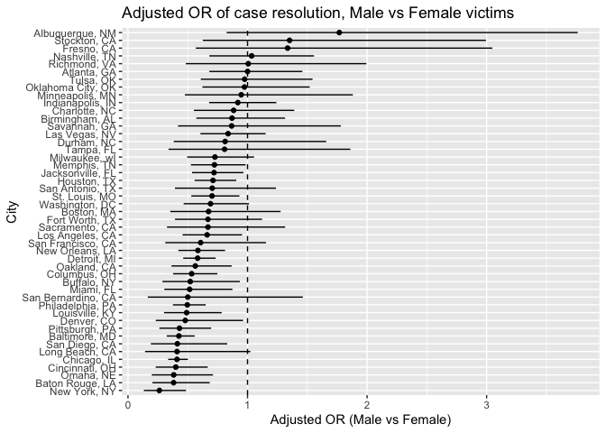

p8105_hw6_mk4996
================
Miho Kawanami
2025-12-01

``` r
library(tidyverse)
```

    ## ── Attaching core tidyverse packages ──────────────────────── tidyverse 2.0.0 ──
    ## ✔ dplyr     1.1.4     ✔ readr     2.1.5
    ## ✔ forcats   1.0.0     ✔ stringr   1.5.1
    ## ✔ ggplot2   3.5.2     ✔ tibble    3.3.0
    ## ✔ lubridate 1.9.4     ✔ tidyr     1.3.1
    ## ✔ purrr     1.1.0     
    ## ── Conflicts ────────────────────────────────────────── tidyverse_conflicts() ──
    ## ✖ dplyr::filter() masks stats::filter()
    ## ✖ dplyr::lag()    masks stats::lag()
    ## ℹ Use the conflicted package (<http://conflicted.r-lib.org/>) to force all conflicts to become errors

``` r
library(p8105.datasets)
library(modelr)
library(broom)
```

    ## 
    ## Attaching package: 'broom'
    ## 
    ## The following object is masked from 'package:modelr':
    ## 
    ##     bootstrap

``` r
set.seed(1)
```

# Problem 1

## filtering the data

``` r
homicide_raw = 
  read_csv("./homicide-data.csv")
```

    ## Rows: 52179 Columns: 12
    ## ── Column specification ────────────────────────────────────────────────────────
    ## Delimiter: ","
    ## chr (9): uid, victim_last, victim_first, victim_race, victim_age, victim_sex...
    ## dbl (3): reported_date, lat, lon
    ## 
    ## ℹ Use `spec()` to retrieve the full column specification for this data.
    ## ℹ Specify the column types or set `show_col_types = FALSE` to quiet this message.

``` r
homicide_df = 
  homicide_raw |> 
  mutate(
    city_state = str_c(city, ", ", state),
    resolved  = as.numeric(disposition == "Closed by arrest")
  ) |> 

  filter(
    !(city_state %in% c(
      "Dallas, TX", "Phoenix, AZ", "Kansas City, MO", "Tulsa, AL"
    ))
  ) |>

  filter(victim_race %in% c("White", "Black")) |>

  mutate(victim_age = as.numeric(victim_age)) |>

  select(city_state, resolved, victim_age, victim_sex, victim_race)
```

    ## Warning: There was 1 warning in `mutate()`.
    ## ℹ In argument: `victim_age = as.numeric(victim_age)`.
    ## Caused by warning:
    ## ! NAs introduced by coercion

## Baltimore, MD

``` r
baltimore_df = 
  homicide_df |> 
  filter(city_state == "Baltimore, MD")

fit_baltimore = 
  baltimore_df |> 
  glm(
    resolved ~ victim_age + victim_race + victim_sex,
    data   = _,
    family = binomial()
  )

or_ci_baltimore = 
  fit_baltimore |> 
  broom::tidy(conf.int = TRUE) |> 
  mutate(
    OR       = exp(estimate),
    conf.low = exp(conf.low),
    conf.high = exp(conf.high)
  ) |>
  filter(term == "victim_sexMale") |>
  select(term, OR, conf.low, conf.high)

or_ci_baltimore
```

    ## # A tibble: 1 × 4
    ##   term              OR conf.low conf.high
    ##   <chr>          <dbl>    <dbl>     <dbl>
    ## 1 victim_sexMale 0.426    0.324     0.558

## each city

``` r
city_or_results = 
  homicide_df |> 
  nest(data = -city_state) |> 
  mutate(
    models = map(
      data,
      \(df) glm(
        resolved ~ victim_age + victim_race + victim_sex,
        data   = df,
        family = binomial()
      )
    ),
    results = map(
      models,
      \(mod) broom::tidy(mod, conf.int = TRUE)
    )
  ) |>
  select(-data, -models) |>
  unnest(results) |>
  mutate(
    OR       = exp(estimate),
    conf.low = exp(conf.low),
    conf.high = exp(conf.high)
  ) |>
  filter(term == "victim_sexMale") |>
  select(city_state, OR, conf.low, conf.high)
```

    ## Warning: There were 43 warnings in `mutate()`.
    ## The first warning was:
    ## ℹ In argument: `results = map(models, function(mod) broom::tidy(mod, conf.int =
    ##   TRUE))`.
    ## Caused by warning:
    ## ! glm.fit: fitted probabilities numerically 0 or 1 occurred
    ## ℹ Run `dplyr::last_dplyr_warnings()` to see the 42 remaining warnings.

``` r
city_or_results
```

    ## # A tibble: 47 × 4
    ##    city_state         OR conf.low conf.high
    ##    <chr>           <dbl>    <dbl>     <dbl>
    ##  1 Albuquerque, NM 1.77     0.825     3.76 
    ##  2 Atlanta, GA     1.00     0.680     1.46 
    ##  3 Baltimore, MD   0.426    0.324     0.558
    ##  4 Baton Rouge, LA 0.381    0.204     0.684
    ##  5 Birmingham, AL  0.870    0.571     1.31 
    ##  6 Boston, MA      0.674    0.353     1.28 
    ##  7 Buffalo, NY     0.521    0.288     0.936
    ##  8 Charlotte, NC   0.884    0.551     1.39 
    ##  9 Chicago, IL     0.410    0.336     0.501
    ## 10 Cincinnati, OH  0.400    0.231     0.667
    ## # ℹ 37 more rows

``` r
city_or_results |> 
  mutate(city_state = fct_reorder(city_state, OR)) |>
  ggplot(aes(x = city_state, y = OR)) +
  geom_point() +
  geom_errorbar(aes(ymin = conf.low, ymax = conf.high), width = 0) +
  geom_hline(yintercept = 1, linetype = "dashed") +
  coord_flip() +
  labs(
    x = "City",
    y = "Adjusted OR (Male vs Female)",
    title = "Adjusted OR of case resolution, Male vs Female victims"
  )
```

<!-- -->

# Problem 2

## bootstrap: weather data

``` r
data("weather_df")

weather_fit = 
  weather_df |>
  lm(tmax ~ tmin + prcp, data = _)

set.seed(1)

boot_results = 
  weather_df |> 
  modelr::bootstrap(n = 5000) |> 
  mutate(
    models = map(
      strap,
      \(df) lm(tmax ~ tmin + prcp, data = df)
    ),
    glance_res = map(models, broom::glance),
    tidy_res   = map(models, broom::tidy)
  ) |>
  select(-strap, -models) |>
  mutate(
    glance_res = map(glance_res, as_tibble),
    tidy_res   = map(tidy_res,   as_tibble)
  ) |>
  unnest(glance_res) |>

  select(.id, r.squared, tidy_res) |>
  unnest(tidy_res) |>
  select(.id, r.squared, term, estimate) |>

  pivot_wider(
    names_from  = term,
    values_from = estimate
  ) |>
  transmute(
    .id,
    r_sq          = r.squared,
    beta1_over_2  = tmin / prcp    
  )

boot_results
```

    ## # A tibble: 5,000 × 3
    ##    .id    r_sq beta1_over_2
    ##    <chr> <dbl>        <dbl>
    ##  1 0001  0.941        -202.
    ##  2 0002  0.940        -222.
    ##  3 0003  0.944        -166.
    ##  4 0004  0.941        -228.
    ##  5 0005  0.944        -149.
    ##  6 0006  0.938        -172.
    ##  7 0007  0.943        -181.
    ##  8 0008  0.942        -229.
    ##  9 0009  0.938        -152.
    ## 10 0010  0.940        -205.
    ## # ℹ 4,990 more rows

# Problem 3

## 1. Load and Prepare Birthweight Data

``` r
birthweight_df = 
  read_csv("./birthweight.csv") |>
  
  mutate(
    babysex = factor(babysex),
    frace   = factor(frace),
    mrace   = factor(mrace),
    malform = factor(malform)
  ) |>
  drop_na()
```

    ## Rows: 4342 Columns: 20
    ## ── Column specification ────────────────────────────────────────────────────────
    ## Delimiter: ","
    ## dbl (20): babysex, bhead, blength, bwt, delwt, fincome, frace, gaweeks, malf...
    ## 
    ## ℹ Use `spec()` to retrieve the full column specification for this data.
    ## ℹ Specify the column types or set `show_col_types = FALSE` to quiet this message.

## 2. Fit Proposed Birthweight Model (Infant + Maternal Predictors)

``` r
birthweight_mod =
  birthweight_df |>
  lm(
    bwt ~ gaweeks + blength + babysex +
          momage + parity,
    data = _
  )

summary(birthweight_mod)
```

    ## 
    ## Call:
    ## lm(formula = bwt ~ gaweeks + blength + babysex + momage + parity, 
    ##     data = birthweight_df)
    ## 
    ## Residuals:
    ##     Min      1Q  Median      3Q     Max 
    ## -1702.1  -213.4   -11.3   204.1  4139.9 
    ## 
    ## Coefficients:
    ##              Estimate Std. Error t value Pr(>|t|)    
    ## (Intercept) -4438.836     99.745 -44.502  < 2e-16 ***
    ## gaweeks        26.566      1.725  15.398  < 2e-16 ***
    ## blength       127.652      1.995  63.972  < 2e-16 ***
    ## babysex2      -17.184     10.150  -1.693   0.0905 .  
    ## momage          8.037      1.310   6.133 9.37e-10 ***
    ## parity        119.063     49.152   2.422   0.0155 *  
    ## ---
    ## Signif. codes:  0 '***' 0.001 '**' 0.01 '*' 0.05 '.' 0.1 ' ' 1
    ## 
    ## Residual standard error: 331.5 on 4336 degrees of freedom
    ## Multiple R-squared:  0.5816, Adjusted R-squared:  0.5811 
    ## F-statistic:  1206 on 5 and 4336 DF,  p-value: < 2.2e-16
